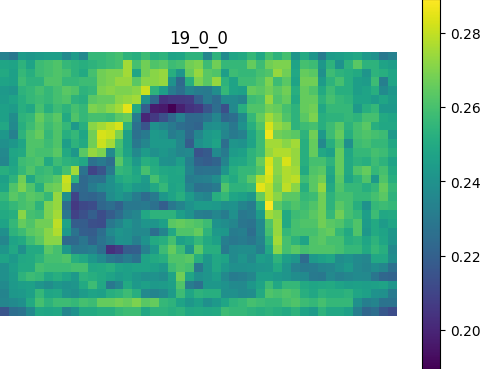
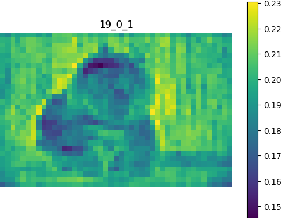
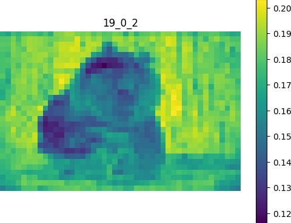
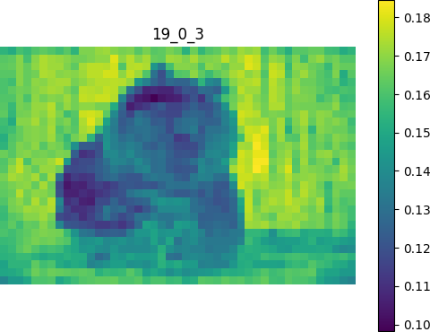
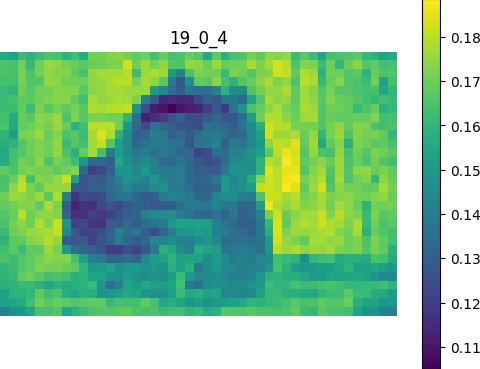
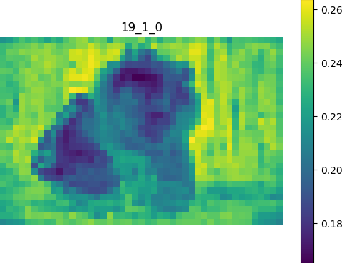

## Abstract
In the previous tasks of image generation and video generation, tasks such as multi-object generation, editing, and motion customization were addressed through analysis of attention maps, leading to the creation of various innovative solutions.  

The powerful generation capabilities of [CogVideoX](https://github.com/THUDM/CogVideo) partly benefit from its 3D full attention map, which encompasses attention across different positions between frames, offering greater potential for controllable generation.  

The code may contain errors and optimization opportunities (e.g., high memory usage. One possible solution is to save the attention maps locally before proceeding with subsequent visualizations). Please raise these issues in the issues. If this repository has saved you valuable time, please consider giving it a star. Thank you!

## Examples
Part of the attention maps from the final step of denoising.

...